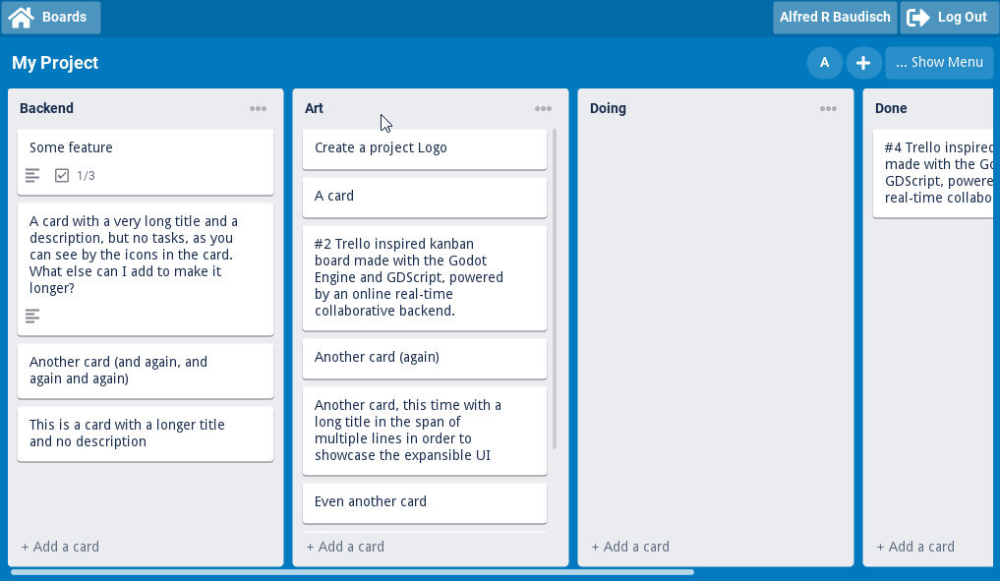
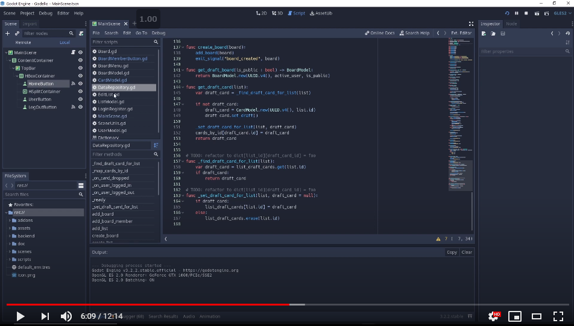

# Godello (aka GodoTrello)   

Trello inspired kanban board made with the [Godot Engine](http://godotengine.org/) and GDScript, powered by an online real-time collaborative backend made with [Elixir](https://elixir-lang.org/) and [Phoenix Channels](https://phoenixframework.org/) (with the possibility of additional backend languages and frameworks). **ATTENTION: 70% done. Remaining WIP in the branch [integrate_elixir](https://github.com/alfredbaudisch/Godello/tree/integrate_elixir). See "[Progress](#progress-)" below.**

## Table of Contents

- [Introduction Video](#introduction-video)
- [Motivation 💡](#motivation-)
- [Features 🎛️](#features-️)
- [Progress 🚧](#progress-)
  - [What is finished](#what-is-finished)
  - [Work in progress](#work-in-progress)
- [Roadmap 🗺️](#roadmap-️)
- [Sponsorship and Donations ❤️](#sponsorship-and-donations-️)
- [Updates 📡](#updates-)
- [License ⚖️](#license-%EF%B8%8F)

## Introduction Video

## Motivation 💡

A Godot Engine proof of concept for:

- Business applications
- Advanced GUI
- Complex data architecture and data modeling
- Real-time online data flow
- Connected multi-user collaborative interfaces and interactions

In the end, the idea is to showcase Godot as a viable option for native Desktop applications and tools, no matter how simple or complex/advanced the application and the interface are.

## Features 🎛️

- Trello-like interface, data organization and interactions:
  - Support for multiple Kanban Boards with Lists and Cards
  - Ordering and positioning of Lists and Cards by dragging and dropping
  - In place editing (example: clicking a card's title to edit it)
  - Support for hundreds of lists and cards in the same board, without loss of frame rate
  - Card description and TODO list
- Repository data design pattern
- Reactive [React](https://reactjs.org/)-like, pseudo two-way data binding and data propagation using Godot's [signals](https://docs.godotengine.org/en/stable/getting_started/step_by_step/signals.html).
- Real-time online connectivity and multiple user collaboration using Godot's [WebSockets](https://docs.godotengine.org/en/stable/tutorials/networking/websocket.html).
  - The backend layer is implemented using an agnostic BackendAdapter, this way any backend language and framework can be used. The BackendAdapter even allows to remove the usage of WebSockets and use only HTTP or local calls.
  - The main backend implementation is made with [Elixir](http://elixir-lang.org/) + [Phoenix Channels](https://phoenixframework.org/) backed by a PostgreSQL database. Communication with Godot is done using the library [GodotPhoenixChannels](https://github.com/alfredbaudisch/GodotPhoenixChannels).
- Multi-user presence detection
- User account flow (sign-up and login)
- Multi-resolution responsive and expansible interface
  - Interface elements are all implemented with [Godot's Control](https://docs.godotengine.org/en/stable/classes/class_control.html) nodes, inside Container nodes, there is no usage of Node2D's nodes.

## Progress 🚧

### What is finished

- The GodotEngine frontend:
  - Trello-like interface and all its local interactions, including the dragging and dropping of Lists and Cards.
  - The main data architecture, with reactive, two way data bindings and the Repository design pattern.
  - Scene flow.
- The [Elixir](https://elixir-lang.org/) + [Phoenix Channels](https://phoenixframework.org/) backend, backed by a PostgreSQL database (it's in the branch [backend_elixir](https://github.com/alfredbaudisch/Godello/tree/backend_elixir), still not merged into `master`).

### Work in progress

- The real-time connectivity and multi-user collaboration via the integration with the Elixir backend is currently a work in process in the branch [integrate_elixir](https://github.com/alfredbaudisch/Godello/tree/integrate_elixir).
- Since the frontend in the `master` branch is not integrated with the backend, no data is persisted (all data is lost as soon as the application is closed and the application is opened as a blank canvas).
- Although the data architecture is finished in the frontend, the work in the `integrate_elixir` branch is constantly making changes to it, to better accomodate the needs of the backend integration.

## Roadmap 🗺️

- Finish the Elixir + Phoenix Channels [integration](https://github.com/alfredbaudisch/Godello/tree/integrate_elixir).
- Code refactoring following Godot's style guide.
- Immutable reactivity, Redux-like.
  - This will allow for undos and redos, as well optimistic UI interactions.
- Optimistic UI updates.
  - Currently it's inbetween optimistic and pessimistic.
- A course titled "Creating Advanced Interfaces and connected Business Applications with Godot" where we build this project from scratch
  - Instead of a course, process videos could be an option
- Additional Trello features:
  - Share boards publically without inviting individual members (via a code that can be typed into the Godot application)
  - Card file attachments
- User account improvements:
  - Password recovery
  - Profile management (update user profile and credentials)
- Additional backends and backend adapters:
  - Node.js (Express + socket.io)
  - Kotlin (Ktor)
  - PHP (Laravel)

## Sponsorship and Donations ❤️

You can support my open-source contributions and this project on [Patreon](https://www.patreon.com/alfredbaudisch) or with a [PayPal donation](https://www.paypal.com/donate?hosted_button_id=FC5FTRRE3548C). Patrons and donors of any tier will have their name listed here. Patrons of the **Sponsors** tier or higher, can also have a link and a logo listed here.

- Mike King

## Updates 📡

For news and more code and art experiments and prototypes:

- Follow me on [Twitter 🐦](https://twitter.com/alfredbaudisch)
- Subscribe to my [YouTube channel 📺](https://www.youtube.com/channel/UChbQcnM4z0e0c1PhHY72jgA/videos)

## License ⚖️

MIT License - Copyright (c) 2020 Alfred Reinold Baudisch
